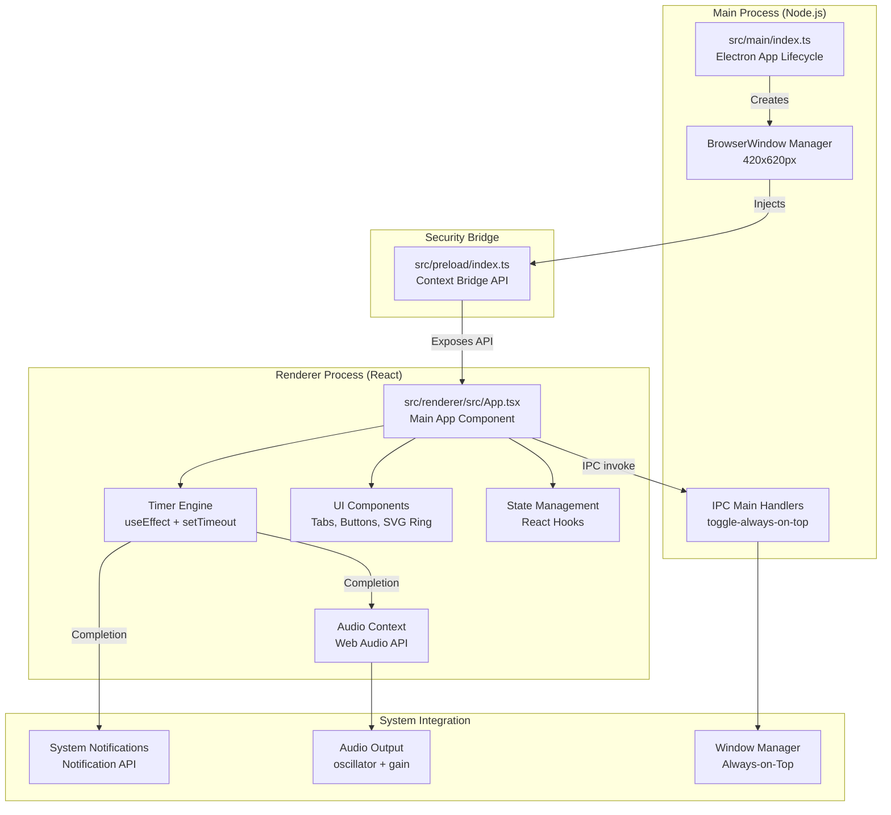
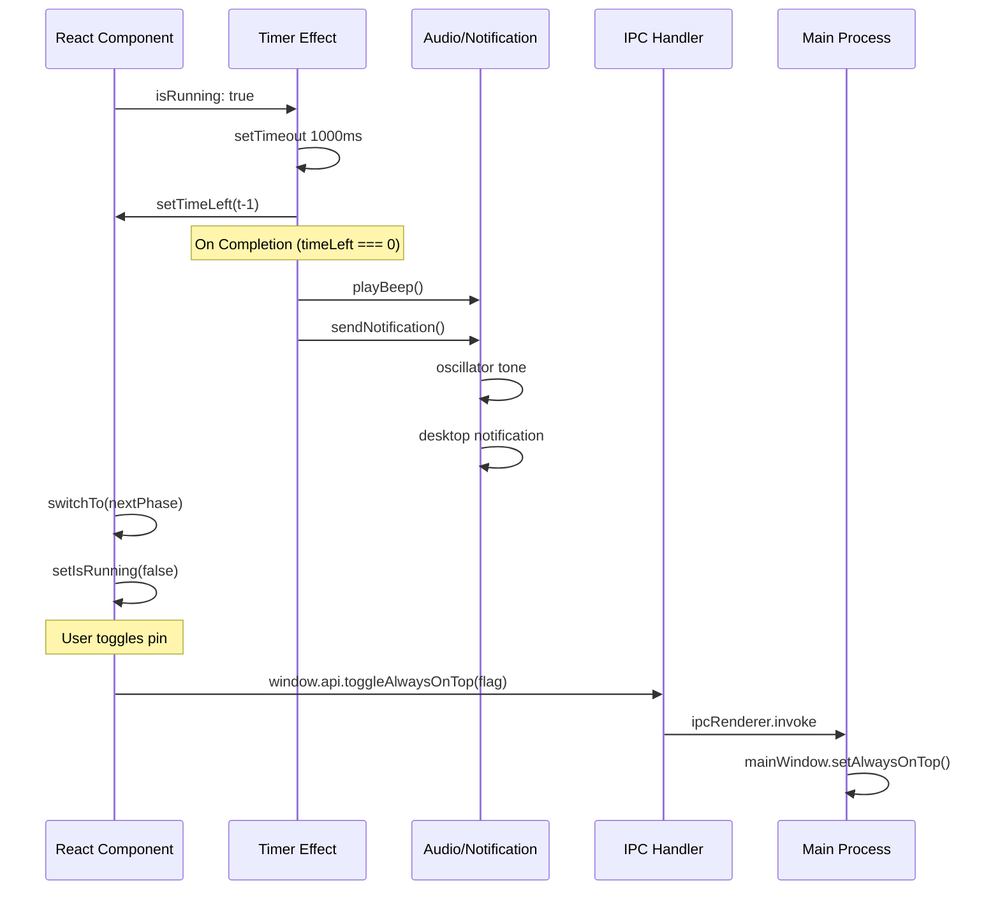

# Mon Pomodoro

> A lightweight, feature-rich Pomodoro timer desktop application built with Electron, React, and TypeScript.


## Overview

**Mon Pomodoro** is a minimalist desktop productivity application implementing the Pomodoro Technique. It provides a distraction-free environment for focused work sessions with customizable timers, native system notifications, audio feedback, and an intuitive circular progress visualization.

Whether you're working on deep focus tasks, managing your time effectively, or building sustainable work habits, Mon Pomodoro keeps you on track with a beautiful, native desktop interface.

### Key Highlights

- **Native Desktop Experience** — Built with Electron for true cross-platform compatibility
- **Customizable Sessions** — Adjust focus and break durations (1–90 minutes)
- **Visual & Audio Feedback** — Circular progress ring, system notifications, and synthesized audio alerts
- **Always-on-Top Window** — Pin the timer to stay visible while working in other applications
- **Session Tracking** — Track your pomodoro cycles with visual progress indicators
- **Keyboard Shortcuts** — Fast, distraction-free navigation without touching the mouse
- **Modern UI** — Dark theme with smooth animations and phase-specific color schemes

---

## Tech Stack

| Layer | Technology | Version |
|-------|-----------|---------|
| **Desktop Framework** | Electron | ^39.2.6 |
| **UI Framework** | React | ^19.2.1 |
| **Language** | TypeScript | ^5.9.3 |
| **Build Tool** | Electron Vite | ^5.0.0 |
| **Bundler** | Vite | ^7.2.6 |
| **Packager** | Electron Builder | ^26.0.12 |
| **Icon Library** | Lucide React | ^1.21.0 |
| **Code Quality** | ESLint, Prettier | ^9.39.1, ^3.7.4 |

---

## Prerequisites

Before you begin, ensure you have the following installed on your system:

- **Node.js** — v18 or higher ([download](https://nodejs.org/))
- **npm** — v9 or higher (included with Node.js)
- **Git** — for cloning the repository

To verify your installation:

```bash
node --version    # v18.x.x or higher
npm --version     # v9.x.x or higher
git --version     # Any recent version
```

---

## Installation

### 1. Clone the Repository

```bash
git clone https://github.com/ncharles11/mon-pomodoro.git
cd mon-pomodoro
```

### 2. Install Dependencies

```bash
npm install
```

This will install all required dependencies including Electron, React, TypeScript, and development tools.

### 3. Run in Development Mode

```bash
npm run dev
```

The application will start with hot-module reloading (HMR) enabled, allowing you to see changes instantly as you edit code.

---

## Configuration

### Environment Variables

No environment variables are required for basic functionality. The application works out-of-the-box with sensible defaults.

### Duration Settings

Users can customize session durations through the in-app Settings panel:

- **Focus Session** — Default: 25 minutes (range: 1–90 minutes)
- **Short Break** — Default: 5 minutes (range: 1–90 minutes)
- **Long Break** — Default: 15 minutes (range: 1–90 minutes)

Settings are managed through the Settings button (⚙️) in the application UI. Session duration adjustments apply immediately if the timer is not running.

---

## Usage

### Running the Application

#### Development Mode

```bash
npm run dev
```

Launches the app with hot-reload enabled. Perfect for development and testing.

#### Production Mode (Preview)

```bash
npm start
```

Runs the packaged application to test the production build locally.

### User Guide

#### Timer Phases

The application operates in three phases:

1. **Focus (Red)** — 25 minutes of concentrated work
2. **Short Break (Green)** — 5-minute pause between sessions
3. **Long Break (Blue)** — 15-minute break after every 4 focus sessions

#### Controls

| Element | Action | Keyboard Shortcut |
|---------|--------|-------------------|
| **Phase Tabs** | Switch between Focus, Short Break, Long Break | `1`, `2`, `3` |
| **Play/Pause Button** | Start or pause the timer | `Space` |
| **Reset Button** | Reset timer to full duration of current phase | `R` |
| **Settings Button** | Open settings panel to adjust durations | N/A |
| **Pin Button** | Toggle "always on top" window pinning | N/A |

#### Session Tracking

The application tracks completed pomodoro sessions:

- **Dots** — Visual progress through the 4-pomodoro cycle
- **Session Counter** — Displays total pomodoros completed and current cycle
- **Auto-Advance** — After 4 focus sessions, long break automatically triggers

#### Notifications

When a session completes:

1. **System Notification** — Desktop notification with session summary
2. **Audio Alert** — Three-tone synthesized beep (can be muted via system volume)

The application requests notification permission on first launch. You can adjust notification settings in your OS preferences.

#### Always-on-Top

Click the **Pin** button in the header to toggle window pinning. When pinned, the timer floats above all other windows, perfect for reference during work sessions.

---

## Build & Deployment

### Development Build (Unpacked)

Generate unpacked artifacts for local testing:

```bash
npm run build:unpack
```

Output location: `./out` directory

### Platform-Specific Builds

#### macOS (Apple Silicon & Intel)

```bash
npm run build:mac
```

Creates a `.dmg` installer and standalone application bundle.

#### Windows

```bash
npm run build:win
```

Creates an installer executable and portable `.exe` file.

#### Linux

```bash
npm run build:linux
```

Creates AppImage and Debian package formats.

### Full Production Build

Build the application for all platforms:

```bash
npm run build
```

This runs TypeScript type checking and generates optimized bundles via Electron Vite. Artifacts will be located in `./out`.

---

## Project Structure

```
mon-pomodoro/
├── src/
│   ├── main/                      # Main process (Node.js)
│   │   └── index.ts              # Electron window creation, IPC handlers
│   ├── preload/                   # Preload script (context bridge)
│   │   ├── index.ts              # Secure API exposure
│   │   └── index.d.ts            # Type definitions
│   └── renderer/                  # Renderer process (React frontend)
│       ├── src/
│       │   ├── App.tsx           # Main app component, timer logic
│       │   ├── main.tsx          # React entry point
│       │   ├── env.d.ts          # Vite types
│       │   └── assets/
│       │       ├── main.css      # Component styles
│       │       └── base.css      # Global styles
│       └── index.html            # HTML template
├── resources/                     # Application icons and assets
├── out/                           # Build output (generated)
├── electron.vite.config.ts       # Electron Vite configuration
├── tsconfig.json                 # TypeScript base config
├── tsconfig.node.json            # Node/main process types
├── tsconfig.web.json             # React/renderer types
├── package.json                  # Dependencies and scripts
├── eslint.config.mjs             # Linting rules
└── README.md                      # This file
```

---

## Architecture

### System Overview



### Data Flow: Timer Tick



### Key Components

#### Main Process (`src/main/index.ts`)

- **Window Creation** — Creates a fixed-size (420×620px), non-resizable BrowserWindow
- **Platform-Specific Styling** — Applies macOS `hiddenInset` title bar on macOS
- **IPC Handlers** — Exposes `toggle-always-on-top` to the renderer
- **Application Lifecycle** — Manages app initialization and window restoration on macOS

#### Preload Script (`src/preload/index.ts`)

- **Context Bridge** — Safely exposes `api.toggleAlwaysOnTop()` to the renderer
- **Security** — Prevents direct Node.js access from the renderer process
- **Electron Toolkit Integration** — Exposes standard `@electron-toolkit/preload` APIs

#### Renderer (App Component, `src/renderer/src/App.tsx`)

**State Management:**
- `phase` — Current phase (focus, shortBreak, longBreak)
- `durations` — Customizable session lengths
- `timeLeft` — Remaining time in seconds
- `isRunning` — Timer state
- `sessions` — Count of completed pomodoro sessions
- `showSettings` — Settings panel visibility
- `isPinned` — Always-on-top toggle state

**Key Hooks:**
- **`useEffect` (Timer)** — High-precision countdown using `setTimeout`
- **`useEffect` (Keyboard)** — Listens for Space, R, 1, 2, 3 keys
- **`useCallback`** — Memoized phase switching, reset, and completion logic

**Audio & Notifications:**
- **`playBeep()`** — Uses Web Audio API to create a three-tone alert (660→880→1100 Hz)
- **`sendNotification()`** — Triggers system notifications via the Notification API

---

## Running Tests & Quality Checks

### TypeScript Type Checking

Check for type errors across the entire project:

```bash
npm run typecheck
```

Runs TypeScript validation on both main process (`tsconfig.node.json`) and renderer (`tsconfig.web.json`).

### ESLint & Code Formatting

Lint the codebase for style and logical issues:

```bash
npm run lint
```

Format code to match project style conventions:

```bash
npm run format
```

This will apply Prettier formatting to all supported files.

---

## Development Workflow

### Setting Up for Development

1. **Clone and install:**
   ```bash
   git clone https://github.com/yourusername/mon-pomodoro.git
   cd mon-pomodoro
   npm install
   ```

2. **Start dev server:**
   ```bash
   npm run dev
   ```

3. **Make changes** to any file under `src/`. Changes will hot-reload automatically.

### Common Development Tasks

| Task | Command |
|------|---------|
| Type check | `npm run typecheck` |
| Lint code | `npm run lint` |
| Format code | `npm run format` |
| Build for dev testing | `npm run build:unpack` |
| Build for macOS | `npm run build:mac` |
| Build for Windows | `npm run build:win` |
| Build for Linux | `npm run build:linux` |

### Debugging

#### React DevTools

Electron apps support React DevTools. If you want to add debugging capabilities:

1. Install `electron-devtools-installer` as a dev dependency
2. Load React DevTools in the main process
3. Open DevTools via `Ctrl+Shift+I` / `Cmd+Shift+I`

#### Main Process Debugging

Use Electron's built-in inspector or VS Code:

```bash
# Enable main process debugging
node --inspect-brk ./node_modules/.bin/electron .
```

---

## Features

| Feature | Description | Status |
|---------|-------------|--------|
| **Pomodoro Timer** | Focus (25min) → Short Break (5min) → Long Break (15min) cycle | ✓ Implemented |
| **Customizable Durations** | Adjust all session lengths from 1–90 minutes | ✓ Implemented |
| **Visual Progress Ring** | Animated circular progress indicator with phase-specific colors | ✓ Implemented |
| **Session Tracking** | Visual dots representing 4-pomodoro cycle progress | ✓ Implemented |
| **System Notifications** | Native OS notifications on session completion | ✓ Implemented |
| **Audio Alerts** | Three-tone synthesized beep via Web Audio API | ✓ Implemented |
| **Keyboard Shortcuts** | Space (play/pause), R (reset), 1-3 (switch phases) | ✓ Implemented |
| **Always-on-Top Window** | Pin timer to float above other applications | ✓ Implemented |
| **Dark Theme** | Sleek dark UI with accent colors per phase | ✓ Implemented |
| **Cross-Platform** | Runs on macOS, Windows, and Linux | ✓ Implemented |

---

## Contributing

Contributions are welcome! To contribute:

1. **Fork** the repository
2. **Create a feature branch:**
   ```bash
   git checkout -b feature/your-feature-name
   ```
3. **Make your changes** and commit with clear messages:
   ```bash
   git commit -m "feat: add your feature description"
   ```
4. **Push to your fork:**
   ```bash
   git push origin feature/your-feature-name
   ```
5. **Open a Pull Request** with a description of your changes

### Code Standards

- Follow the existing code style (enforced by ESLint & Prettier)
- Run `npm run format` before committing
- Run `npm run lint` and `npm run typecheck` to ensure quality
- Write clear commit messages and PR descriptions

---

## License

This project is licensed under the MIT License. See the LICENSE file for details.

---

## Acknowledgments

- Built with [Electron](https://www.electronjs.org/)
- UI powered by [React](https://react.dev/)
- Icons from [Lucide React](https://lucide.dev/)
- Configured with [Electron Vite](https://electron-vite.org/)
- Build & packaging by [Electron Builder](https://www.electron.build/)

---

## Support

For issues, questions, or feature requests:

- **GitHub Issues** — [Report a bug or suggest a feature](https://github.com/yourusername/mon-pomodoro/issues)
- **Discussions** — [Ask questions and share ideas](https://github.com/yourusername/mon-pomodoro/discussions)

---

## Changelog

See [CHANGELOG.md](./CHANGELOG.md) for a history of changes and version releases.

---

**Made with ❤️ for focused, productive work.**
